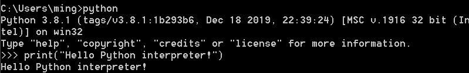
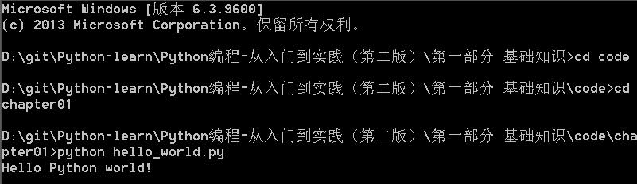

[toc]

# 起步

## 1.1 搭建编程环境

### 1.1.1 Python 版本

[Python download](https://www.python.org/downloads/)

### 1.1.2 运行 Python 代码片段

```python
print("Hello Python interpreter!")
```



### 1.1.3 Sublime Text 简介

简单的文本编辑器。

推荐使用`Visual Studio Code(VS Code)`。[Visual Studio Code 配置 Python 环境](https://blog.csdn.net/actionwind/article/details/104032418?spm=1001.2101.3001.6650.1&utm_medium=distribute.pc_relevant.none-task-blog-2%7Edefault%7ECTRLIST%7ERate-1-104032418-blog-114673705.235%5Ev28%5Epc_relevant_default_base1&depth_1-utm_source=distribute.pc_relevant.none-task-blog-2%7Edefault%7ECTRLIST%7ERate-1-104032418-blog-114673705.235%5Ev28%5Epc_relevant_default_base1&utm_relevant_index=2)

## 1.2 在不同的操作系统中搭建 Python 编程环境

1.2.1 在 Windows 系统中搭建 Python 编程环境

1.2.2 在 macOS 系统中搭建 Python 编程环境

1.2.3 在 Linux 系统中搭建 Python 编程环境

## 1.3 运行 Hello World 程序

```python
print("Hello Python world!")
```

## 1.4 解决安装问题

## 1.5 从终端运行 Python 程序

### 1.5.1 在 Windows 终端运行 Python 程序

步骤:

1. 进入文件所在的目录
2. 运行程序



### 在 Linux 和 macOS 系统中从终端运行 Python 程序

## 1.6 小结

本章中，大致了解了`Python`，安装了`Python`。安装了一个文本编辑器，简化`Python`代码的编写工作。学会了在终端中运行`Python`代码，并运行了第一个程序`hello_world.py`。
