[toc]

# 变量和简单数据类型

## 2.1 运行 hello_world.py 时发生的情况

```python
print("Hello Python world!")
```

- `print()`是一个函数
- 语法高亮

## 2.2 变量

```python
message = "Hello Python world!"
print(message)
```

- 添加了`message`的变量，指向文本`"Hello Python world!"`

> `Python` 解释器的工作：
>
> 1. 处理第一行代码：将变量 `message` 与文本`"Hello Python world!"`关联起来。
> 2. 处理第二行代码：将 `message` 关联的值打印到屏幕。

---

扩展一下程序：

```python
message = "Hello Python world!"
print(message)

message = "Hello Python Crash Course world!"
print(message)
```

- 在程序中可随时修改变量的值，`Python`始终记录变量的最新值。

### 2.2.1 变量的命名和使用

`Python`中使用变量需要遵守的规则：

1. 变量名只能包含字母、数字和下划线。变量名能以字母或下划线开头，不能以数字开头。
2. 变量名不能包含空格，但能使用下划线来分隔其中的单词。
3. 不能将`Python`关键字和函数名用作变量名。
4. 变量名应既简短又具有描述性。
5. 慎用小写字母`l`和大写字母`O`，因为它们可能会被错认为是数字`1`和`0`。

### 2.2.2 使用变量时避免命名错误

错误的代码：

```python
message = "Hello Python world!"
print(mesage)
```

编译器提供的`traceback`：
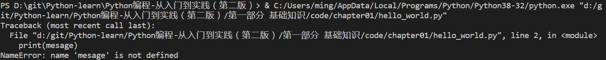

在这里编译器提供了一个名称错误，并报告打印的变量`mesage`未定义。

> 名称错误通常意味着两种情况：要么是使用变量前忘记赋值，要么是输入变量名时拼写不正确。

### 2.2.3 变量时标签

变量是可以赋给值的标签，也可以说变量指向特定的值。

## 2.3 字符串

字符串是一种数据类型。字符串就是一系列字符。在`Python`中，用引号括起来的都是字符串，其中引号可以是单引号，也可以是双引号。

### 2.3.1 使用方法修改字符串的大小写

1. 方法`title()`

   - 在`name.title()`中，`name`后面的句点`(.)`让`Python`对变量`name`执行方法`title()`指定的操作。
   - 方法`title()`以首字母大写的方式显示每个单词，即将每个单词的首字母都改为大写。

   > 每个方法后面都跟着一对圆括号，这是因为方法通常需要额外的信息来完成工作。这种信息是在圆括号内提供的。函数`title()`不需要额外的信息，因此它后面的圆括号是空的。

   ```python
   name = "ada lovelace"
   print(name.title())
   ```

   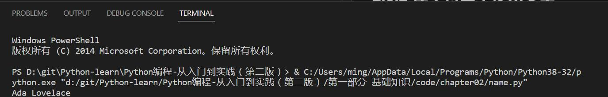

2. `upper()`与`lower()`方法

   - 将字符串改为全部大写或全部小写

   ```python
   name = "ada lovelace"
   print(name.upper())
   print(name.lower())
   ```

   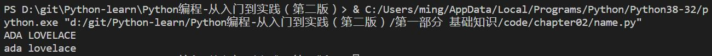

### 2.3.2 在字符串中使用变量

在字符串中插入变量的值，可在前引号前加上字母`f`，再将要插入的变量放在花括号内。这样，当`Python`显示字符时，将把每个变量都替换为其值。

> 这种字符串名为`f字符串`。`f`是`format`（设置格式）的简称，因为`Python`通过把花括号内的变量替换为其值来设置字符串的格式。

```python
first_name = "ada"
last_name = "lovelace"
full_name = f"{first_name} {last_name}"
message = f"Hello, {full_name.title()}!"
print(message)
```

执行结果为：

```
Hello, Ada Lovelace!
```

### 2.3.3 使用制表符或换行符来添加空白

在编程中，空白泛指任何非打印字符，如空格、制表符和换行符。可以用空白来组织输出，让用户阅读起来更容易。

1. 制表符：`\t`
   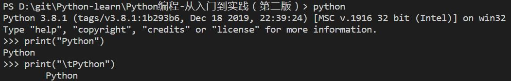
2. 换行符：`\n`
   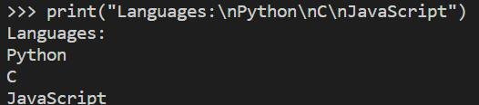

一个字符串中同时包含制表符和换行符：
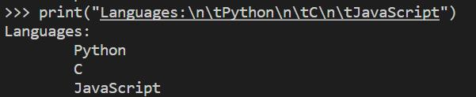

### 2.3.4 删除空白

空白的作用：比较两个字符串是否相同。
删除空白的方法：

1. 删除末尾空白字符：`rstrip()`
2. 删除开头空白字符：`lstrip()`
3. 删除两边空白字符：`strip()`

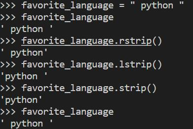

### 2.3.5 使用字符串时避免语法错误

程序中包含非法的`Python`代码时，机会导致语法错误。

```
message = 'One of Python's strengths is its diverse community.'
                        ^
SyntaxError: invalid syntax
```

## 2.4 数

在编程中，经常使用数来记录得分、表示可视化数据、存储`Web`应用信息，等等。

### 2.4.1 整数

在`Python`中，支持对整数的加(+)减(-)乘(\*)除(/)运算、整数除法运算(//, 返回商的整数部分:向下取整)、乘方运算（\*\*）、还支持运算次序。

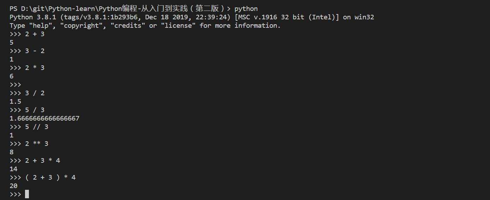

> 空格不影响`Python`计算表达式的方式。

### 2.4.2 浮点数

`Python`将所有带小数点的数称为浮点数。

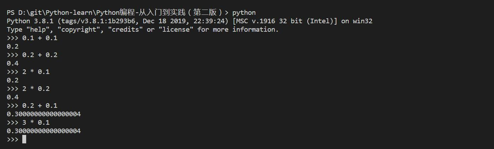

> 结果包含的小数位数可能是不确定的。

### 2.4.3 整数和浮点数

- 将任意两个数相除时，结果总是浮点数，即便这两个数都是整数且能整除。
- 若一个操作数是整数，另一个操作数是浮点数，结果也是浮点数。

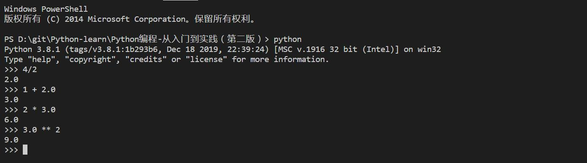

### 2.4.4 数中的下划线

使用的数很大时，用下划线将数字分组，使得更清晰易读。打印数字时不会出现下划线。
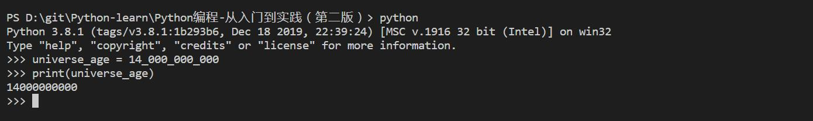

### 2.4.5 同时给多个变量赋值

在一行代码中给多个变量赋值，有助于缩短程序并提高可读性。
用逗号将变量名分开。`Python`将按顺序将每个值赋给对应的变量。

```python
x, y, z = 0, 0, 0
```

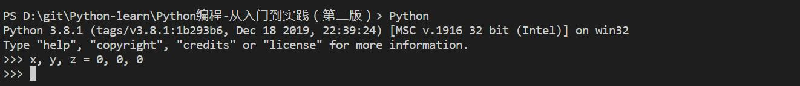

### 2.4.6 常量

常量类似变量，但其值在程序的整个生命周期内保持不变。`Python`没有内置的常量类型，通常使用全大写将某个变量视为常量，其值始终保持不变。

```python
MAX_CONNECTIONS = 5000
```

## 2.5 注释

在程序中添加说明，对解决问题的方法进行大致的阐述。

> 注释让你能够使用自然语言在程序中添加说明。

### 2.5.1 如何编写注释

在`Python`中，注释用井号（#）标识。井号后面的内容都会被`Python`解释器忽略。

```python
# 向大家问好
print("Hello Python people!")
```

`Python`解释器将忽略第一行，只执行第二行。

```
Hello Python people!
```

### 2.5.2 该编写什么样的注释

阐述代码的功能。

## 2.6 Python 之禅

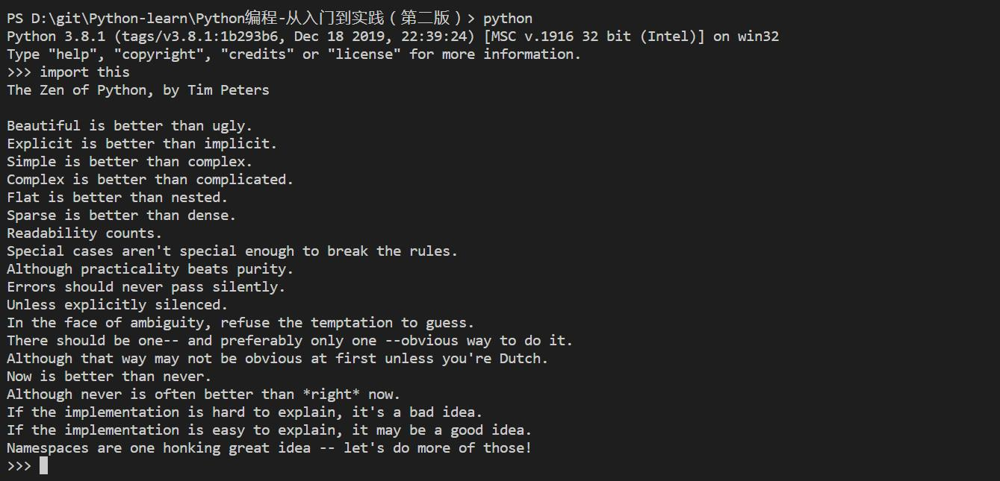

## 2.7 小结

1. 如何使用变量；
2. 如何创建描述性变量名以及如何消除名称错误和语法错误；
3. 字符串是什么，以及如何使用小写、大写和首字母大写方式显示字符串；
4. 使用空白来显示整洁的输出，以及如何剔除字符串中多余的空白；
5. 如何使用整数和浮点数；
6. 一些使用数值数据的方式。
7. 如何编写说明性注释。
